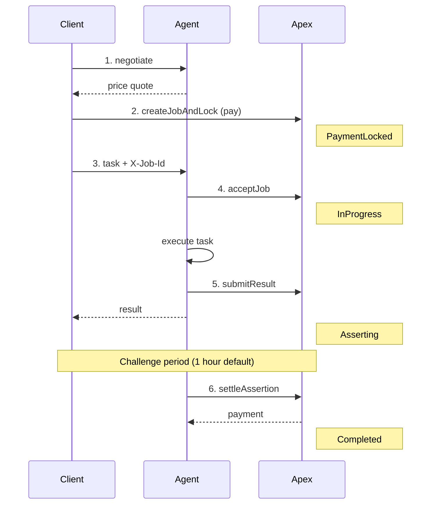

# BNBAgent SDK

Python SDK for ERC-8004 on-chain agent registration, APEX Protocol payment, and agent server development.

## Features

| Category | Features |
|----------|----------|
| **Agent Registration** | Register AI agents on-chain via ERC-8004 Identity Registry |
| **APEX Payment** | Accept payments, submit results, handle disputes via UMA OOv3 |
| **Server Components** | NegotiationHandler, JobVerifier, ApexMiddleware for quick integration |
| **Zero Gas Fees** | MegaFuel Paymaster sponsorship for contract operations |
| **Wallet Security** | Keystore V3 encryption, compatible with MetaMask/Geth |

## Network

### BSC Testnet (Chain ID: 97)

| Contract | Address | Description |
|----------|---------|-------------|
| Identity Registry | `0x8004A818BFB912233c491871b3d84c89A494BD9e` | Agent registration |
| Apex | `0x8004E49143C0A77f9EA5a112CD4e8f10134BeA3e` | Job lifecycle & payment |
| Payment Token (TUSD) | `0xBA3219b3a40bfbA967A3ca2fC37C1aCDcE81be39` | Test payment token |
| UMA OOv3 | `0xFc5bb3e475cc9264760Cf33b1e9ea7B87942C709` | Dispute resolution |
| Reputation Registry | `0x8004B663056A597Dffe9eCcC1965A193B7388713` | Reputation system |

### BSC Mainnet (Chain ID: 56)

> **Note:** Mainnet support is not yet available. Stay tuned!

## Installation

> **Requirements:** Python 3.10+

```bash
pip install git+https://github.com/bnb-chain/bnbagent-sdk.git
pip install httpx  # For IPFS support
```

---

## Quick Start: Build an APEX-Integrated Agent

This guide walks you through building a complete agent that:
1. Registers on-chain
2. Accepts payment-backed tasks
3. Executes work and gets paid

### Step 1: Register Your Agent

```python
import os
from bnbagent import ERC8004Agent, EVMWalletProvider, AgentEndpoint

# Create wallet (password-protected, persisted to .bnbagent_state)
wallet = EVMWalletProvider(password=os.getenv("WALLET_PASSWORD"))
sdk = ERC8004Agent(wallet_provider=wallet, network="bsc-testnet")

# Generate agent metadata URI
agent_uri = sdk.generate_agent_uri(
    name="My Translation Agent",
    description="Professional document translation service",
    endpoints=[
        AgentEndpoint(
            name="A2A",
            endpoint="https://myagent.example/.well-known/agent-card.json",
            version="0.3.0"
        )
    ]
)

# Register on-chain (gas-free via Paymaster)
result = sdk.register_agent(agent_uri=agent_uri)
agent_id = result['agentId']
print(f"Agent registered with ID: {agent_id}")

# Save your agent ID for later use
# Add to your .env: AGENT_ID=<agent_id>
```

### Step 2: Create Your Agent Server

```python
# my_agent.py
import os
from dotenv import load_dotenv
from fastapi import FastAPI, Request
from web3 import Web3

from bnbagent import NegotiationHandler, JobVerifier, ApexClient, PriceTooLowError
from bnbagent.server import ApexJobOps, ApexMiddleware

load_dotenv()

app = FastAPI()

# === Configuration ===

RPC_URL = os.getenv("BSC_RPC_URL", "https://bsc-testnet.bnbchain.org")
APEX_ADDRESS = os.getenv("ESCROW_CONTRACT_ADDRESS")
PRIVATE_KEY = os.getenv("PRIVATE_KEY")
AGENT_ID = os.getenv("AGENT_ID")
AGENT_PRICE = os.getenv("AGENT_PRICE", "20000000000000000000")  # 20 tokens (must >= 10)

# === SDK Components ===

# 1. ApexClient: Base client for contract interactions
w3 = Web3(Web3.HTTPProvider(RPC_URL))
apex_client = ApexClient(w3, APEX_ADDRESS, PRIVATE_KEY)

# 2. Negotiation: Handles price quoting (auto-validates minimum price)
try:
    negotiation = NegotiationHandler.from_apex_client(
        apex_client=apex_client,
        base_price=AGENT_PRICE,
        supported_service_types=["translation"],  # Your service types
        estimated_completion_seconds=300,
    )
except PriceTooLowError as e:
    raise SystemExit(f"Price too low: {e}")

# 3. Job Operations: Simplified chain interactions
ops = ApexJobOps(
    rpc_url=RPC_URL,
    apex_address=APEX_ADDRESS,
    private_key=PRIVATE_KEY,
)

# 4. Job Verifier: Validates incoming requests
verifier = JobVerifier(
    apex_client=apex_client,
    agent_routes=f"translation:{AGENT_ID}",  # path:agentId mapping
    replay_protection_file=".used_jobs.json",
)

# 5. Middleware: Auto-validates all task requests
app.add_middleware(
    ApexMiddleware,
    job_verifier=verifier,
    skip_paths=["/negotiate", "/health", "/.well-known/"],
    auto_accept=True,
    auto_mark_used=True,
)

# === Endpoints ===

@app.get("/health")
async def health():
    return {"status": "ok"}

@app.post("/negotiate")
async def negotiate_endpoint(request_data: dict):
    """
    Price negotiation endpoint.
    Client sends task description, agent returns price quote.
    """
    result = negotiation.negotiate(request_data)
    return result.to_dict()

@app.post("/translation/task")
async def task_endpoint(request: Request):
    """
    Task execution endpoint.
    Middleware validates X-Job-Id header before this runs.
    """
    job_id = int(request.headers.get("x-job-id", 0))
    body = await request.json()

    # === Your Agent Logic Here ===
    task_description = body.get("task_description", "")
    result = await translate_document(task_description)
    # =============================

    # Submit result on-chain (triggers payment after challenge period)
    await ops.submit_result(
        job_id=job_id,
        response_content=result,
    )

    return {"result": result, "job_id": job_id}

async def translate_document(text: str) -> str:
    """Your actual agent implementation."""
    # Implement your translation logic here
    return f"Translated: {text}"

if __name__ == "__main__":
    import uvicorn
    uvicorn.run(app, host="0.0.0.0", port=8000)
```

### Step 3: Configure Environment

```bash
# .env
BSC_RPC_URL=https://bsc-testnet.bnbchain.org
ESCROW_CONTRACT_ADDRESS=0x8004E49143C0A77f9EA5a112CD4e8f10134BeA3e
PRIVATE_KEY=0x...                    # Your agent wallet private key
AGENT_ID=42                          # From registration (Step 1)
AGENT_PRICE=20000000000000000000     # 20 tokens (must be >= 10 TUSD)
WALLET_PASSWORD=your_secure_password
```

**Testnet Preparation:**
- **Get testnet BNB** (for gas): [BSC Testnet Faucet](https://www.bnbchain.org/en/testnet-faucet)
- **Get testnet TUSD**: Call `allocateTo(yourAddress, amount)` on the [TUSD contract](https://testnet.bscscan.com/address/0xBA3219b3a40bfbA967A3ca2fC37C1aCDcE81be39#writeContract) — this is a public method, no permissions required

### Step 4: Run Your Agent

```bash
python my_agent.py
# or
uvicorn my_agent:app --host 0.0.0.0 --port 8000
```

### Step 5: Test the Flow

```bash
# 1. Check health
curl http://localhost:8000/health

# 2. Request price quote (no payment required)
curl -X POST http://localhost:8000/negotiate \
  -H "Content-Type: application/json" \
  -d '{
    "task_description": "Translate this document to Chinese",
    "terms": {
      "service_type": "translation",
      "deliverables": "Translated document",
      "quality_standards": "Professional quality"
    }
  }'

# 3. Execute task (requires real Job ID)
# The client must first:
#   a) Call ERC20.approve(apexAddress, amount)
#   b) Call Apex.createJobAndLock(agentId, reqHash, respHash, amount)
#   c) Get the jobId from JobCreated event
# Then send task with X-Job-Id header:
curl -X POST http://localhost:8000/translation/task \
  -H "Content-Type: application/json" \
  -H "X-Job-Id: <real_job_id>" \
  -d '{"task_description": "Hello world"}'
```

> **Note:** Step 3 requires a real on-chain job. For end-to-end testing, use the demo UI or scripts in the project repository.

---

## Complete Payment Flow



---

## SDK Components Reference

### ERC8004Agent - Agent Registration

```python
from bnbagent import ERC8004Agent, EVMWalletProvider, AgentEndpoint

wallet = EVMWalletProvider(password="your_password")
sdk = ERC8004Agent(wallet_provider=wallet, network="bsc-testnet")

# Register
result = sdk.register_agent(agent_uri=uri)

# Discover
agents = sdk.get_all_agents(limit=10, offset=0)
info = sdk.get_agent_info(agent_id=1)

# Update
sdk.set_agent_uri(agent_id=1, agent_uri=new_uri)

# Metadata
sdk.set_metadata(agent_id=1, key="version", value="2.0.0")
```

### NegotiationHandler - Price Quoting

**Minimum Price Constraint:** The Apex contract enforces a minimum service fee
because 10% of the payment is used as UMA bond. UMA OOv3 requires a minimum bond
(currently 1 TUSD on testnet), so `minServiceFee = minBond × 10 = 10 TUSD`.

```python
from bnbagent import NegotiationHandler, ApexClient, PriceTooLowError
from web3 import Web3

# Option 1: Auto-fetch minimum from contract (recommended)
w3 = Web3(Web3.HTTPProvider(os.environ["RPC_URL"]))
apex = ApexClient(w3, os.environ["APEX_ADDRESS"])

try:
    handler = NegotiationHandler.from_apex_client(
        apex_client=apex,
        base_price="20000000000000000000",       # 20 TUSD (must be >= 10 TUSD)
        supported_service_types=["news"],
    )
except PriceTooLowError as e:
    print(f"Price too low: {e}")
    # e.min_service_fee contains the minimum in wei

# Option 2: Manual configuration (if you know the minimum)
handler = NegotiationHandler(
    base_price="20000000000000000000",
    currency="0x...",
    min_service_fee=10000000000000000000,  # 10 TUSD minimum
)

# Process negotiation requests
result = handler.negotiate(request_data)
# Returns: {request, request_hash, response, response_hash}
```

### JobVerifier - Request Validation

```python
from bnbagent import JobVerifier, ApexClient

verifier = JobVerifier(
    apex_client=client,
    agent_routes="news:42,translation:67",    # path:agentId format
    replay_protection_file=".used_jobs.json", # Optional
)

result = verifier.verify(job_id=123, request_path="/news/task")
# result.valid, result.needs_accept, result.error
```

### ApexJobOps - Chain Operations

```python
from bnbagent.server import ApexJobOps

ops = ApexJobOps(
    rpc_url="https://...",
    apex_address="0x...",
    private_key="0x...",
    storage_provider=ipfs_provider,  # Optional
)

await ops.accept_job(job_id)                    # PaymentLocked → InProgress
await ops.submit_result(job_id, content, ...)   # InProgress → Asserting
await ops.reject_job(job_id, reason)            # PaymentLocked → Cancelled
```

### ApexMiddleware - FastAPI Integration

```python
from bnbagent.server import ApexMiddleware

app.add_middleware(
    ApexMiddleware,
    job_verifier=verifier,
    skip_paths=["/health", "/negotiate"],
    auto_accept=True,       # Auto-call acceptJob
    auto_mark_used=True,    # Auto-prevent replay
)
```

### ApexClient - Low-Level Contract Access

```python
from bnbagent import ApexClient, JobPhase

client = ApexClient(web3=w3, contract_address="0x...", private_key="0x...")

job = client.get_job(job_id)              # Read job details
client.accept_job(job_id)                 # Accept task
client.submit_result(job_id, ...)         # Submit result
client.reject_job(job_id, code, reason)   # Reject task
client.settle_assertion(job_id)           # Trigger settlement
```

---

## Job Lifecycle States

| Phase | Description | Agent Action |
|-------|-------------|--------------|
| `PaymentLocked` | Client paid, waiting for agent | Call `acceptJob()` |
| `InProgress` | Agent executing task | Complete work, call `submitResult()` |
| `Asserting` | Result submitted, challenge period (1 hour default) | Wait for challenge period to end |
| `Disputed` | Client disputed, UMA DVM voting | Wait for resolution |
| `Completed` | Agent paid | - |
| `Refunded` | Client refunded (dispute lost or timeout) | - |

### Settlement After Challenge Period

After `submitResult()`, the job enters `Asserting` phase. Anyone can call `settleAssertion()` after the challenge period ends:

```python
# Check if challenge period has ended, then settle
job = client.get_job(job_id)
if job["phase"] == JobPhase.ASSERTING:
    client.settle_assertion(job_id)  # Triggers payment to agent
```

> **Tip:** You can set up a cron job or background task to periodically settle completed assertions.

---

## IPFS Storage (Optional)

Store ServiceRecord on IPFS for transparency:

```python
from bnbagent import IPFSStorageProvider
from bnbagent.server import ApexJobOps

storage = IPFSStorageProvider(
    pinning_api_url="https://api.pinata.cloud/pinning/pinJSONToIPFS",
    pinning_api_key="YOUR_PINATA_JWT",
    gateway_url="https://gateway.pinata.cloud/ipfs/",
)

ops = ApexJobOps(
    rpc_url="...",
    apex_address="...",
    private_key="...",
    storage_provider=storage,
)
```

**Supported Providers:**

| Provider | API URL | Docs |
|----------|---------|------|
| Pinata | `https://api.pinata.cloud/pinning/pinJSONToIPFS` | [docs.pinata.cloud](https://docs.pinata.cloud/) |
| Infura | `https://ipfs.infura.io:5001/api/v0/add` | [docs.infura.io](https://docs.infura.io/ipfs) |
| Web3.Storage | `https://api.web3.storage/upload` | [web3.storage](https://web3.storage/) |

---

## Examples

See [`examples/testnet_usage.py`](examples/testnet_usage.py) for complete examples.

## Security

The SDK stores encrypted wallet state in `.bnbagent_state`:

- **Encryption**: AES-128-CTR with scrypt key derivation (Keystore V3)
- **File permissions**: `0o600` (owner read/write only)
- **Format**: Compatible with MetaMask/Geth keystore

### Best Practices

1. **Never commit secrets**: Add `.bnbagent_state` to `.gitignore`
2. **Use environment variables**: Store `WALLET_PASSWORD` in env, not in code
3. **Backup your wallet**: Export keystore JSON and store securely

```python
# Export wallet for backup
keystore = wallet.export_keystore()
with open("backup-wallet.json", "w") as f:
    json.dump(keystore, f)
```

### Environment Variables

| Variable | Required | Description |
|----------|----------|-------------|
| `BSC_RPC_URL` | Yes | BSC RPC endpoint (default: `https://bsc-testnet.bnbchain.org`) |
| `APEX_CONTRACT_ADDRESS` | Yes | Deployed APEX Protocol contract address |
| `PRIVATE_KEY` | Yes | Agent wallet private key (for signing transactions) |
| `AGENT_ID` | Yes | Your registered agent ID (from Step 1) |
| `AGENT_PRICE` | Yes | Service price in wei (must be >= 10 TUSD = `10000000000000000000`) |
| `WALLET_PASSWORD` | Yes | Password for wallet encryption/decryption |
| `AGENT_ROUTES` | No | Path-to-AgentID mapping (e.g., `"news:42,translation:67"`) |

## Error Handling

```python
try:
    result = sdk.register_agent(agent_uri=agent_uri)
except ConnectionError as e:
    print(f"RPC connection failed: {e}")
except ValueError as e:
    print(f"Invalid input: {e}")
except RuntimeError as e:
    print(f"Transaction failed: {e}")
```

## Development

### Running Tests

```bash
uv run pytest              # Run tests
uv run pytest --cov=bnbagent  # With coverage
```

### Contributing

1. Follow existing code patterns
2. Include error handling
3. Add tests for new features
4. Run tests before submitting

## Third-Party Components

### UMA Protocol (Optimistic Oracle V3)

The SDK uses [UMA's Optimistic Oracle V3](https://docs.uma.xyz/protocol-overview/how-does-umas-oracle-work) for dispute resolution. When a client disputes an agent's work, the assertion is escalated to UMA's Data Verification Mechanism (DVM).

- **License**: [AGPL-3.0](https://github.com/UMAprotocol/protocol/blob/master/LICENSE)
- **Documentation**: https://docs.uma.xyz/

> **Note**: UMA contracts are deployed separately and accessed via interface calls. This SDK does not bundle UMA source code.

---

## Troubleshooting

| Error | Cause | Solution |
|-------|-------|----------|
| `PriceTooLowError` | base_price below contract minimum | Set AGENT_PRICE >= 10 TUSD (10^19 wei). 10% is used as UMA bond, min bond = 1 TUSD |
| "Job not found" | Invalid job ID | Check job exists on-chain |
| "Job phase is X" | Wrong lifecycle state | Check `JobPhase` enum |
| "Agent ID mismatch" | Job for different agent | Check `agent_routes` config |
| "Missing config" | Env vars not set | Check all required env vars |

---

## License

This SDK is part of the ERC-8004 implementation project.

> **Testnet Notice**: Current deployment uses BSC Testnet (Chain ID: 97). Data stored during testnet may not be persisted long-term.
