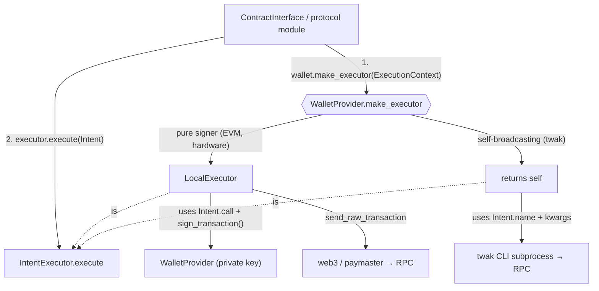

# Wallets

## Overview

The `wallets` module owns two responsibilities in the bnbagent SDK:

1. **Signing** — the `WalletProvider` interface (`address`, `sign_message`,
   `sign_transaction`, `sign_typed_data`). All protocol modules and config
   objects accept a `WalletProvider`, so signing backends are swappable
   without touching application code.
2. **Execution** — the `IntentExecutor` interface (`execute(Intent)`), which
   runs a high-level on-chain operation end-to-end (build + sign + broadcast,
   or delegate to an external backend). This is the seam that lets a wallet
   either be signed-and-broadcast *by* the SDK, or broadcast *itself*.

As of v0.2.0, `WalletProvider` is the **primary** way to configure signing
across the SDK. Both `BNBAgentConfig` and `ERC8183Config` accept
`wallet_provider=` directly, or auto-wrap `private_key` + `wallet_password`
into an `EVMWalletProvider` at construction time (clearing the plaintext key
immediately).

## Architecture

There are **two kinds of wallets**, distinguished by who broadcasts:

| Kind | Examples | Who broadcasts | Executor |
|---|---|---|---|
| **Pure signer** | `EVMWalletProvider`, hardware | The SDK | A shared `LocalExecutor` wraps the signer |
| **Self-broadcasting** | `TWAKProvider` (twak CLI) | The wallet itself | The wallet *is* its own executor |

A pure signer is just a key — it has no web3 connection, so it must be handed
one (an `ExecutionContext`) to broadcast. A self-broadcasting wallet carries
its own connection. To keep callers from branching on wallet kind, each wallet
exposes `make_executor(context)` and decides for itself:



The `Intent` is **dual-representation** so each executor consumes what it
understands:

- `call` — a pre-encoded web3 `ContractFunction`. Used by `LocalExecutor`,
  which stays protocol-agnostic (it never inspects `name`/`kwargs`).
- `name` + `kwargs` — the operation as a namespaced id (e.g.
  `"erc8004.register"`) plus its high-level args. Used by semantic backends
  like `TWAKProvider` that rebuild the call from intent and cannot accept raw
  calldata.

The call site (a contract client that already holds the ABI) produces both
forms cheaply, so the asymmetry between backends never leaks protocol
knowledge into any executor.

## Key Concepts

- **WalletProvider interface** — an `ABC` defining `address`,
  `sign_transaction()`, `sign_message()`, `sign_typed_data()`, plus a
  `make_executor(context)` factory (default: wrap self in a `LocalExecutor`).
- **IntentExecutor interface** — an `ABC` defining `execute(Intent)`. The
  local path and self-broadcasting backends are peer implementations.
- **Intent / ExecutionContext** — `Intent` is the operation to run;
  `ExecutionContext` carries the web3 connection + optional paymaster that a
  pure signer needs to broadcast.
- **LocalExecutor** — the default executor: build + sign (via a
  `WalletProvider`) + broadcast via web3/paymaster, with nonce management,
  pre-flight simulation, gas-price flooring and retry/backoff.
- **Keystore V3 encryption** — `EVMWalletProvider` stores private keys
  encrypted (scrypt KDF + AES-128-CTR), compatible with MetaMask and Geth.
- **In-memory mode** — `EVMWalletProvider(persist=False)` keeps the key in
  memory only. Used internally when configs auto-wrap a `private_key`.
- **Auto-creation** — when no private key is supplied and `persist=True`,
  `EVMWalletProvider` generates a new keypair and persists the keystore.

## Quick Start

```python
from bnbagent.wallets import EVMWalletProvider

# Import an existing private key (encrypted + persisted to disk)
wallet = EVMWalletProvider(password="secure-pw", private_key="0x...")
print(wallet.address)

# In-memory only (no disk I/O — used by config auto-wrap)
wallet = EVMWalletProvider(password="pw", private_key="0x...", persist=False)

# Auto-generate a new wallet (persisted to ~/.bnbagent/wallets/<address>.json)
wallet = EVMWalletProvider(password="secure-pw")
```

Self-broadcasting wallet (delegates to the `twak` CLI):

```python
from bnbagent import ERC8004Agent
from bnbagent.wallets import TWAKProvider

# Key custody lives inside twak; the agent's address is the twak wallet.
wallet = TWAKProvider(chain="bsc")
sdk = ERC8004Agent(wallet_provider=wallet, network="bsc-mainnet")
# register_agent now runs via `twak erc8004 register`, not local web3.
```

## Selecting a Provider & Key Storage

There is **no shared key store** across providers — each owns its own custody,
and an agent picks exactly one:

| Provider | `kind` | `key_location` |
|---|---|---|
| `EVMWalletProvider` | `evm` | `~/.bnbagent/wallets/<address>.json` (Keystore V3) |
| `TWAKProvider` | `twak` | `~/.twak/wallet.json` (encrypted mnemonic) + OS keychain / `TWAK_WALLET_PASSWORD` |
| `MPCWalletProvider` | `mpc` | external MPC enclave (subclass-defined) |

The twak CLI exposes no private-key `import`/`export` or `--keystore-path`, so
its key cannot be shared with the SDK keystore (or vice versa). Treat
"choose a provider" as "choose a custodian"; use `describe()` / `key_location`
to report where a wallet's key lives without unifying storage.

`create_wallet_provider(kind, **kwargs)` is the single creation entry point —
it unifies *selection*, not storage:

```python
from bnbagent.wallets import create_wallet_provider

wallet = create_wallet_provider("evm", password="pw")   # -> EVMWalletProvider
wallet = create_wallet_provider("twak", chain="bsc")     # -> TWAKProvider
print(wallet.describe())  # {"kind": "twak", "address": "0x..", "key_location": "...", "exists": True}
```

Configs accept a `wallet_kind` for non-EVM providers (the `evm` path stays on
the `private_key` + `wallet_password` convenience flow):

```python
config = BNBAgentConfig(wallet_kind="twak", network="bsc-mainnet")
# -> __post_init__ builds TWAKProvider via the factory
```

## API Reference

### `WalletProvider` (ABC)

| Member | Description |
|---|---|
| `address` (property) | Wallet's Ethereum address. |
| `sign_transaction(tx)` | Sign a transaction dict. Returns `rawTransaction`, `hash`, `r`, `s`, `v`. |
| `sign_message(msg)` | EIP-191 personal sign. Returns `messageHash`, `r`, `s`, `v`, `signature`. |
| `sign_typed_data(domain, types, message)` | EIP-712 typed-data sign, gated by a `SigningPolicy`. |
| `make_executor(context)` | Return the `IntentExecutor` for this wallet. Default: wrap self in `LocalExecutor`. |
| `kind` (class attr) | Stable provider id (`"evm"` / `"twak"` / `"mpc"`); used by the factory and introspection. |
| `key_location` (property) | Human-readable custody location, or `None` if unknown/not applicable. |
| `exists()` | Whether durable key material backs this provider (never raises). |
| `describe()` | Uniform, non-sensitive summary: `{kind, address, key_location, exists}`. |

### `EVMWalletProvider`

Production wallet provider backed by a local private key with Keystore V3
encryption. Uses the default `make_executor` (→ `LocalExecutor`).

| Method | Description |
|---|---|
| `__init__(password, private_key=None, persist=True)` | Import a key or load/create an encrypted wallet. |
| `export_private_key()` | Return the hex private key (handle with care). |
| `export_keystore()` | Return the Keystore V3 JSON dict. |
| `get_wallet_info()` | Return `{"address": "0x..."}` (no secrets). |

Constructor behavior:
1. If `private_key` is provided: import and encrypt it (save to disk only if `persist=True`).
2. If `persist=True` and no key: load existing keystore from state file, or create a new wallet.
3. If `persist=False` and no key: raises `ValueError` (key is required for in-memory mode).

### `TWAKProvider`

Self-broadcasting wallet backed by the Trust Wallet Agent Kit (`twak`) CLI.
Implements both `WalletProvider` and `IntentExecutor` (it `make_executor`s to
itself). Key custody lives entirely inside twak.

| Member | Description |
|---|---|
| `address` | Read from `twak wallet address` (cached). |
| `sign_message` / `sign_typed_data` | Via `twak wallet sign-message` / `sign-typed-data`. |
| `sign_transaction` | `NotImplementedError` — twak has no raw-tx signing primitive. |
| `execute(intent)` | Runs `erc8004.register` / `set_metadata` / `set_agent_uri` via the CLI. |
| `create_wallet()` | Create a twak wallet if none exists (idempotent). Password never on the CLI. |
| auto-create | Like EVM, a wallet is created automatically on first use if absent (lazy). |

Notes: targets BNB Smart Chain via the twak chain key `bsc` (mainnet) or
`bsc-testnet` — ERC-8004/8183 are deployed on both (`bsc-testnet` is being
rolled out on the twak side; until it lands, twak rejects it at runtime). The
wallet password is read by twak from the OS keychain or `TWAK_WALLET_PASSWORD`
(never passed on the command line). `register` replays metadata as follow-up
`set-metadata` txs (best-effort) because twak's `register` has no inline
metadata parameter.

**Prerequisites (one-time, caller's responsibility).** `TWAKProvider` creates
the wallet for you (auto-create), but never handles API secrets. Before the
first operation:

1. Install the CLI: `npm install -g @trustwallet/cli`.
2. Set API credentials: `twak init --api-key <id> --api-secret <secret>`, or
   export `TWAK_ACCESS_ID` / `TWAK_HMAC_SECRET` (CI). twak reads these itself.
3. Make the password reachable: `TWAK_WALLET_PASSWORD` env var or
   `twak wallet keychain save`. (Wallet creation itself is automatic — see
   below.)

When a step is missing, the command fails and the raised error appends a short
pointer back to these steps.

**Auto-create vs EVM.** Both providers create a wallet automatically when none
exists. `EVMWalletProvider` does it at construction (it holds the password and
generates the key in-process). `TWAKProvider` keeps construction
side-effect-free and instead auto-creates **lazily on the first operation**
(via `twak wallet create`), because creation shells out to twak. The password
is resolved by twak from `TWAK_WALLET_PASSWORD` / keychain — never placed on
the command line. Steps 1–2 (CLI install + API credentials) remain the
caller's responsibility; if they're missing, the first operation blocks with a
clear error. Call `create_wallet()` directly to create eagerly.

### `LocalExecutor`

Default `IntentExecutor`. Builds, signs (via the wrapped `WalletProvider`) and
broadcasts `intent.call` through web3, using the paymaster when present.
Owns nonce management, pre-flight `eth_call`, gas-price flooring and retry.

### `Intent` / `IntentExecutor` / `ExecutionContext`

- `Intent(name, kwargs, call, value, gas, description)` — a single high-level
  operation in both semantic and mechanical form.
- `IntentExecutor.execute(intent) -> dict` — returns at least
  `{"transactionHash", "receipt"}` (executors may add `agentId`, etc.).
- `ExecutionContext(web3, paymaster, receipt_timeout)` — the context a pure
  signer needs to build a `LocalExecutor`.

### `MPCWalletProvider` (stub)

Placeholder for future MPC support. Raises `NotImplementedError` on
instantiation.

## Config Auto-Wrap

Both `BNBAgentConfig` and `ERC8183Config` support a convenience pattern:

```python
from bnbagent.erc8183.config import ERC8183Config
from bnbagent.wallets import EVMWalletProvider

# These are equivalent:
config = ERC8183Config(
    wallet_provider=EVMWalletProvider(password="pw", private_key="0x...", persist=False)
)

config = ERC8183Config(private_key="0x...", wallet_password="pw")
# -> __post_init__ auto-wraps into EVMWalletProvider(persist=False)
# -> private_key is cleared to "" (no plaintext retained)
```

The `from_env()` class methods read `PRIVATE_KEY` + `WALLET_PASSWORD` from
environment variables and perform the same auto-wrap.

## Implementing a Custom Provider

**A pure signer** only implements the signing members; it inherits the default
`make_executor` (→ `LocalExecutor`), so the SDK builds and broadcasts for it:

```python
from bnbagent.wallets.wallet_provider import WalletProvider

class HardwareWalletProvider(WalletProvider):
    @property
    def address(self) -> str:
        return self._hw_address

    def sign_transaction(self, transaction: dict) -> dict:
        ...  # Delegate to hardware device

    def sign_message(self, message: str) -> dict:
        ...  # Delegate to hardware device

    def sign_typed_data(self, domain, types, message) -> dict:
        ...  # Delegate to hardware device
```

**A self-broadcasting wallet** also implements `IntentExecutor` and overrides
`make_executor` to return itself:

```python
from bnbagent.wallets.intents import ExecutionContext, Intent, IntentExecutor
from bnbagent.wallets.wallet_provider import WalletProvider

class CustodialWalletProvider(WalletProvider, IntentExecutor):
    def make_executor(self, context: ExecutionContext) -> IntentExecutor:
        return self  # owns its own broadcast

    def execute(self, intent: Intent) -> dict:
        # Translate intent.name + intent.kwargs into a custodial API call
        ...
```

## Security Notes

- Private keys are **never** stored in plain text by `EVMWalletProvider`.
  Legacy plain-text state files are migrated to Keystore V3 on first load.
- Keystore files are saved with `0o600` permissions (owner read/write only).
- `export_private_key()` logs a warning — avoid calling it in production.
- Config objects clear the `private_key` field to `""` immediately after
  wrapping into a `WalletProvider`. No plaintext private key is retained.
- **`SigningPolicy` gates the local `sign_typed_data` path only.** A
  self-broadcasting wallet (e.g. `TWAKProvider`) signs out of process, so the
  SDK's policy does not gate it — that backend's own safeguards apply.

## Related

- [`erc8004`](../erc8004/README.md) — builds `Intent`s and runs them via the wallet's executor.
- [`erc8183`](../erc8183/README.md) — uses `WalletProvider` via `ERC8183Config` for job transactions.
- [`core`](../core/README.md) — `ContractClientMixin` delegates signing to `WalletProvider`.
