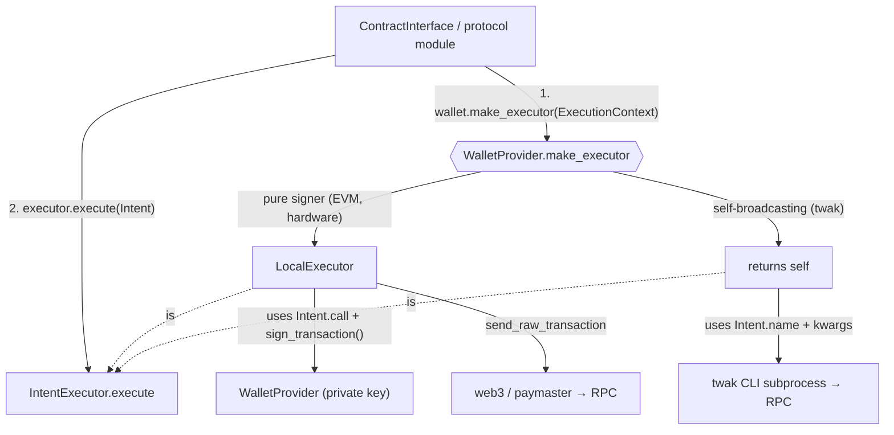

# Wallets

## Overview

The `wallets` module owns two responsibilities in the bnbagent SDK:

1. **Signing** — the `WalletProvider` interface (`address`, `sign_message`,
   `sign_transaction`, `sign_typed_data`). All protocol modules and config
   objects accept a `WalletProvider`, so signing backends are swappable
   without touching application code.
2. **Execution** — the `IntentExecutor` interface (`execute(Intent)`), which
   runs a high-level on-chain operation end-to-end (build + sign + broadcast,
   or delegate to an external backend). This is the seam that lets a wallet
   either be signed-and-broadcast *by* the SDK, or broadcast *itself*.

As of v0.2.0, `WalletProvider` is the **primary** way to configure signing
across the SDK. Both `BNBAgentConfig` and `ERC8183Config` accept
`wallet_provider=` directly, or auto-wrap `private_key` + `wallet_password`
into an `EVMWalletProvider` at construction time (clearing the plaintext key
immediately).

## Architecture

There are **two kinds of wallets**, distinguished by who broadcasts:

| Kind | Examples | Who broadcasts | Executor |
|---|---|---|---|
| **Pure signer** | `EVMWalletProvider`, hardware | The SDK | A shared `LocalExecutor` wraps the signer |
| **Self-broadcasting** | `TWAKProvider` (twak CLI) | The wallet itself | The wallet *is* its own executor |

A pure signer is just a key — it has no web3 connection, so it must be handed
one (an `ExecutionContext`) to broadcast. A self-broadcasting wallet carries
its own connection. To keep callers from branching on wallet kind, each wallet
exposes `make_executor(context)` and decides for itself:



The `Intent` is **dual-representation** so each executor consumes what it
understands:

- `call` — a pre-encoded web3 `ContractFunction`. Used by `LocalExecutor`,
  which stays protocol-agnostic (it never inspects `name`/`kwargs`).
- `name` + `kwargs` — the operation as a namespaced id (e.g.
  `"erc8004.register"`) plus its high-level args. Used by semantic backends
  like `TWAKProvider` that rebuild the call from intent and cannot accept raw
  calldata.

The call site (a contract client that already holds the ABI) produces both
forms cheaply, so the asymmetry between backends never leaks protocol
knowledge into any executor.

## Key Concepts

- **WalletProvider interface** — an `ABC` where only `address` is abstract.
  The `sign_*` methods default to raising `UnsupportedWalletOperation` —
  overriding one *is* the capability declaration. Two factories absorb
  backend differences: `make_executor(context)` (default: wrap self in a
  `LocalExecutor`, gated on `sign.transaction`) and `make_x402_payer()`
  (default: capability gate; delegated backends override it).
- **Capabilities** — an open set of strings
  (`bnbagent.wallets.capabilities`) answering "can this wallet do X":
  `sign.*` values are auto-derived from method overrides, everything else is
  declared via `_extra_capabilities`. Query with `supports(cap)` /
  `capabilities()` / `describe()["capabilities"]`. Consumers ignore unknown
  values and treat absence as unsupported (the EIP-5792 omission rule).
- **IntentExecutor interface** — an `ABC` defining `execute(Intent)`. The
  local path and self-broadcasting backends are peer implementations.
- **Intent / ExecutionContext** — `Intent` is the operation to run;
  `ExecutionContext` carries the web3 connection + optional paymaster that a
  pure signer needs to broadcast.
- **LocalExecutor** — the default executor: build + sign (via a
  `WalletProvider`) + broadcast via web3/paymaster, with nonce management,
  pre-flight simulation, gas-price flooring and retry/backoff.
- **Keystore V3 encryption** — `EVMWalletProvider` stores private keys
  encrypted (scrypt KDF + AES-128-CTR), compatible with MetaMask and Geth.
- **In-memory mode** — `EVMWalletProvider(persist=False)` keeps the key in
  memory only. Used internally when configs auto-wrap a `private_key`.
- **Auto-creation** — when no private key is supplied and `persist=True`,
  `EVMWalletProvider` generates a new keypair and persists the keystore.

## Quick Start

```python
from bnbagent.wallets import EVMWalletProvider

# Import an existing private key (encrypted + persisted to disk)
wallet = EVMWalletProvider(password="secure-pw", private_key="0x...")
print(wallet.address)

# In-memory only (no disk I/O — used by config auto-wrap)
wallet = EVMWalletProvider(password="pw", private_key="0x...", persist=False)

# Auto-generate a new wallet (persisted to ~/.bnbagent/wallets/<address>.json)
wallet = EVMWalletProvider(password="secure-pw")
```

Self-broadcasting wallet (delegates to the `twak` CLI):

```python
from bnbagent import ERC8004Agent
from bnbagent.wallets import TWAKProvider

# Key custody lives inside twak; the agent's address is the twak wallet.
wallet = TWAKProvider(chain="bsc")
sdk = ERC8004Agent(wallet_provider=wallet, network="bsc-mainnet")
# register_agent now runs via `twak erc8004 register`, not local web3.
```

## Selecting a Provider & Key Storage

There is **no shared key store** across providers — each owns its own custody,
and an agent picks exactly one:

| Provider | `kind` | `key_location` |
|---|---|---|
| `EVMWalletProvider` | `evm` | `~/.bnbagent/wallets/<address>.json` (Keystore V3) |
| `TWAKProvider` | `twak` | `<home or ~>/.twak/wallet.json` (encrypted mnemonic) + OS keychain / `TWAK_WALLET_PASSWORD` |
| `MPCWalletProvider` | `mpc` | external MPC enclave (subclass-defined) |

The twak CLI exposes no private-key `import`/`export` or `--keystore-path`, so
its key cannot be shared with the SDK keystore (or vice versa). Treat
"choose a provider" as "choose a custodian"; use `describe()` / `key_location`
to report where a wallet's key lives without unifying storage.

`create_wallet_provider(kind, **kwargs)` is the single creation entry point —
it unifies *selection*, not storage:

```python
from bnbagent.wallets import create_wallet_provider

wallet = create_wallet_provider("evm", password="pw")   # -> EVMWalletProvider
wallet = create_wallet_provider("twak", chain="bsc")     # -> TWAKProvider
print(wallet.describe())  # {"kind": "twak", "address": "0x..", "key_location": "...",
                          #  "exists": True, "capabilities": ["broadcast.self", ...]}
```

Configs accept a `wallet_kind` for non-EVM providers (the `evm` path stays on
the `private_key` + `wallet_password` convenience flow):

```python
config = BNBAgentConfig(wallet_kind="twak", network="bsc-mainnet")
# -> __post_init__ builds TWAKProvider via the factory
```

## API Reference

### `WalletProvider` (ABC)

| Member | Description |
|---|---|
| `address` (property) | Wallet's Ethereum address. The only abstract member. |
| `sign_transaction(tx)` | Sign a transaction dict. Returns `rawTransaction`, `hash`, `r`, `s`, `v`. Default raises `UnsupportedWalletOperation`; overriding declares `sign.transaction`. |
| `sign_message(msg)` | EIP-191 personal sign. Returns `messageHash`, `r`, `s`, `v`, `signature`. Default raises; overriding declares `sign.message`. |
| `sign_typed_data(domain, types, message)` | EIP-712 typed-data sign, gated by a `SigningPolicy`. Default raises; overriding declares `sign.typed_data`. |
| `capabilities()` | Set of capability strings: auto-derived `sign.*` + `_extra_capabilities`. |
| `supports(cap)` | Membership test on `capabilities()`. |
| `make_executor(context)` | Return the `IntentExecutor` for this wallet. Default: wrap self in `LocalExecutor`; requires `sign.transaction` and raises at this construction point when absent. |
| `make_x402_payer(**kw)` | Return the `X402Payer` for this wallet. Default: capability gate (raises `UnsupportedWalletOperation`); delegated payment backends override it. `kwargs` forward verbatim to the payer constructor. |
| `kind` (class attr) | Stable provider id (`"evm"` / `"twak"` / `"mpc"`); used by the factory and introspection. |
| `fund_bundles_approval` (class attr) | Behavior flag (not a capability): `True` when the wallet's ERC-8183 `fund` bundles the token approval itself, so the SDK skips its own allowance top-up. |
| `key_location` (property) | Human-readable custody location, or `None` if unknown/not applicable. |
| `exists()` | Whether durable key material backs this provider (never raises). |
| `describe()` | Uniform, non-sensitive summary: `{kind, address, key_location, exists, capabilities}`. |

### `EVMWalletProvider`

Production wallet provider backed by a local private key with Keystore V3
encryption. Uses the default `make_executor` (→ `LocalExecutor`).

| Method | Description |
|---|---|
| `__init__(password, private_key=None, persist=True)` | Import a key or load/create an encrypted wallet. |
| `export_private_key()` | Return the hex private key (handle with care). |
| `export_keystore()` | Return the Keystore V3 JSON dict. |
| `get_wallet_info()` | Return `{"address": "0x..."}` (no secrets). |

Constructor behavior:
1. If `private_key` is provided: import and encrypt it (save to disk only if `persist=True`).
2. If `persist=True` and no key: load existing keystore from state file, or create a new wallet.
3. If `persist=False` and no key: raises `ValueError` (key is required for in-memory mode).

### `TWAKProvider`

Self-broadcasting wallet backed by the Trust Wallet Agent Kit (`twak`) CLI —
**v0.19.0 minimum** (an older CLI answers `unknown command`/`unknown option`
on the flags this provider emits, and the raised error says to upgrade rather
than pointing at setup). Implements both
`WalletProvider` and `IntentExecutor` (it `make_executor`s to itself). Key
custody lives entirely inside twak. Design rationale:
[`docs/twak-integration-design.md`](../../docs/twak-integration-design.md);
upstream gap tracking (the `REQ-n` / `S-n` IDs cited below):
[`docs/twak-cli-gaps-v0.18.0.md`](../../docs/twak-cli-gaps-v0.18.0.md).

| Member | Description |
|---|---|
| `address` | Read from `twak wallet address` (cached); the `expected_address` identity check runs on the first lookup. |
| `sign_message` | Via `twak wallet sign-message`. The CLI itself now returns a `0x`-prefixed signature + `digest` field (gaps S-4, shipped v0.19.0); the SDK keeps its adapter — idempotent `0x` normalization, its own EIP-191 digest, and an ecrecover self-check — as an integrity loop (the v0.19.0 CLI digest byte-matches the SDK's computation, cross-checked). |
| `sign_transaction` / `sign_typed_data` | **Not overridden** — the base default raises `UnsupportedWalletOperation` (twak has no raw-tx or generic EIP-712 primitive; not overriding keeps them out of `capabilities()`). |
| `execute(intent)` | Full dispatch: 3 `erc8004.*` + 13 `erc8183.*` intents, 1:1 with the v0.19.0 command menu. `opt_params` passes through raw (`--opt-params`) on every erc8183 write — REQ-1 for `submit`, S-1 for the rest, both shipped in v0.19.0 (see the signing model below). |
| `make_x402_payer(**kw)` | Returns a `TwakX402Payer` — the delegated x402 path (see below). |
| `x402_quote` / `x402_request` | Raw x402 CLI transport used by the payer (policy checks live in the payer). |
| `create_wallet()` | Create a twak wallet if none exists (idempotent). Password never on the CLI. |
| `fund_bundles_approval = True` | twak's `erc8183 fund` does approve + deposit itself; the SDK skips its own allowance top-up. |

Constructor (all keyword-only):

```python
TWAKProvider(
    chain="bsc",            # or "bsctestnet" — twak's two BNB Smart Chain keys.
                            # The spec's "bsc-testnet" spelling is REJECTED by the
                            # real CLI (CHAIN_UNSUPPORTED) — field-verified.
    twak_bin="twak",        # point at node_modules/.bin/twak to pin a version
    timeout=120,            # seconds per CLI invocation
    home=None,              # run every twak subprocess with HOME=<home> so state
                            # lives under <home>/.twak — for read-only code mounts,
                            # multi-agent isolation on one OS user, and test
                            # isolation (gaps S-5)
    expected_address=None,  # pin the on-chain identity: a mismatch raises
                            # WalletIdentityMismatch before any operation (INV-4)
    auto_create=True,       # deployments MUST pass False: the wallet may only come
                            # from materialization — never be silently minted (INV-4)
)
```

Notes (all field-verified against twak v0.19.0):

- `erc8004 register` takes repeatable `--metadata key=value` flags, so
  registration metadata is **atomic with the mint**. (The pre-v0.18.0
  `set-metadata` replay workaround is resolved and removed.)
- `erc8183 fund` pins the amount with `--expected-budget` (gaps S-2, shipped
  v0.19.0): the contract reverts atomically with `BudgetMismatch()` if the
  on-chain budget drifted. This replaced the provider's old client-side
  `status` pre-check, closing the check-then-fund race for good.
- The wallet password is read by twak from the OS keychain or
  `TWAK_WALLET_PASSWORD` — never passed on the command line (INV-1).

**Prerequisites (one-time, caller's responsibility).** `TWAKProvider` creates
the wallet for you (auto-create), but never handles API secrets. Before the
first operation:

1. Install the CLI: `npm install -g @trustwallet/cli` (>= v0.19.0).
2. Set API credentials: `twak init --api-key <id> --api-secret <secret>`, or
   export `TWAK_ACCESS_ID` / `TWAK_HMAC_SECRET` (CI). twak reads these itself.
3. Make the password reachable: `TWAK_WALLET_PASSWORD` env var or
   `twak wallet keychain save`. (Wallet creation itself is automatic — see
   below.)

When a step is missing, the command fails and the raised error appends a short
pointer back to these steps.

**Auto-create vs EVM.** Both providers create a wallet automatically when none
exists. `EVMWalletProvider` does it at construction (it holds the password and
generates the key in-process). `TWAKProvider` keeps construction
side-effect-free and instead auto-creates **lazily on the first operation**
(via `twak wallet create`), because creation shells out to twak. The password
is resolved by twak from `TWAK_WALLET_PASSWORD` / keychain — never placed on
the command line. Steps 1–2 (CLI install + API credentials) remain the
caller's responsibility; if they're missing, the first operation blocks with a
clear error. Call `create_wallet()` directly to create eagerly — or pass
`auto_create=False` (deployment mode) to make a missing wallet an error
instead (see the deployment recipe below).

#### TWAK signing model & capabilities

twak is a **permanently constrained but cleanly bounded** backend: it executes
a fixed command menu and signs everything inside its own process — it is never
asked to "sign bytes", only to "do things". What that means per role:

| Role / operation | TWAK | Why / tracking |
|---|---|---|
| ERC-8183 **client (buyer)** — `create_job → set_budget → register_job → fund → settle` / `dispute` | ✅ | Full lifecycle via the intent dispatch, field-tested on `bsctestnet`. |
| ERC-8183 **provider (seller)** — `submit` | ✅ (>= v0.19.0, **REQ-1** shipped) | `submit` passes `{"deliverable_url": …}` through as raw `--opt-params`, proven on-chain: `bsctestnet` job 150's `JobInitialised` event carries the full deliverable-URL JSON (v0.18.0 jobs emitted empty optParams). The other erc8183 writes pass `opt_params` through too (**S-1**, also v0.19.0) — the old fail-fast guards are retired; on an older CLI the unknown flag fails loudly with an upgrade hint. |
| ERC-8183 **evaluator / voter** — `complete`, `vote_reject`, `settle` | ✅ | |
| **x402 buyer** | ✅ (mainnet routes) | Via the delegated `TwakX402Payer` (`make_x402_payer()`). twak rejects testnet routes as "no supported route" (testnet routes are being worked on upstream). |
| **`X402Signer`** | ❌ | No `sign.typed_data` — `X402Signer(twak_wallet)` is rejected at composition time with a pointer to `make_x402_payer()`. |
| **Paymaster (sponsored gas)** | ✅ mainnet · ❌ testnet (**REQ-2**) | On `bsc` mainnet twak sponsors broadcasts automatically (MegaFuel, since v0.18.0 — nothing to configure). On `bsctestnet` gas is paid from the twak wallet's BNB — **pre-fund it**. The SDK-side paymaster is never used (twak owns its own broadcast); `make_executor` logs a WARNING when handed one. |
| **Arbitrary contract calls** | ❌ | Fixed command menu; an unknown intent raises with a pointer to use an EVM wallet (`calls.arbitrary`). |

The capability sets, verbatim from `capabilities()`:

| Provider | `capabilities()` |
|---|---|
| `evm` | `sign.message`, `sign.transaction`, `sign.typed_data`, `calls.arbitrary`, `paymaster.sponsor` |
| `twak` | `sign.message`, `broadcast.self`, `intents.erc8004`, `intents.erc8183`, `x402.pay` |

Constants live in `bnbagent.wallets.capabilities`; check them with
`wallet.supports(cap)` or read `wallet.describe()["capabilities"]`. For
`sign_typed_data` specifically, three gates carry the weight: assembly-time
(`capabilities()` lacks `sign.typed_data`, so the tool never enters a route),
composition-time (`X402Signer.__init__` checks `supports()`), and runtime (the
base default raises a descriptive `UnsupportedWalletOperation` — no CLI call
is ever attempted).

#### x402 with a TWAK wallet

twak's x402 is a complete HTTP client — it discovers the 402 challenge, signs
the EIP-3009/Permit2 authorization internally and settles. So instead of the
`X402Signer` signing primitive, a TWAK wallet plugs in one level up, as a
**delegated payer**:

```python
payer = wallet.make_x402_payer(          # -> TwakX402Payer
    session_budget=tracker,              # optional, shared with the signer path
    expected_pay_to="0x...",             # optional recipient pin
    expected_asset="0x...",              # optional token pin
)
quote = payer.quote(url)                 # read-only — NEVER creates a wallet
result = payer.request(url, max_payment=100_000)
```

- **Three guard layers, by design** (the per-call cap is enforced twice on
  purpose): the application policy layer (host allowlists, USD day/month
  budgets — wallet-agnostic, sits above the payer) → the payer's precheck on
  the quoted terms (`payTo`, `asset` — which for EIP-3009 *is* the EIP-712
  domain `verifyingContract`, `amount ≤ max_payment`, the claimed
  `maxTimeoutSeconds`, and route pinning via `--prefer-*`) → twak's own
  `--max-payment` hard cap. `SigningPolicy` cannot run on this path (the
  payload never leaves the twak process), so each of its rules has a semantic
  equivalent in the precheck.
- **The session budget debits the *quoted* amount** — the CLI surfaces no
  settlement receipt in its JSON output (gaps S-7), so there is nothing to
  reconcile against. Same for `X402PaymentResult`: its payment metadata comes
  from the quoted route, and `transaction` is best-effort from the endpoint
  body.
- **`quote()` never creates a wallet**: a price check is read-only and must
  not mint an on-chain identity (INV-4).
- **pieverse attribution**: the paying wallet must be **SIWE-bound** to the
  pieverse account beforehand (a `wallet.sign_message` flow) — an unbound
  wallet's payment settles but is not attributed.

#### Deployment (secrets manager) recipe

In deployment the encrypted twak state does not live on disk ahead of time —
it comes from a secret bundle and is materialized at cold start:

| Bundle key | Content |
|---|---|
| `TWAK_WALLET_JSON` | The encrypted wallet file (AES-256-GCM mnemonic), verbatim. |
| `TWAK_CREDENTIALS_JSON` | The API-credentials file (optional — the env-var form below also works). |
| `TWAK_WALLET_PASSWORD` | Wallet unlock password. Stays an env var; twak reads it itself. |
| `TWAK_ACCESS_ID` / `TWAK_HMAC_SECRET` | twak API credentials (env form, designed for CI/containers). |

Cold-start sequence:

```python
import os

from bnbagent.wallets import TWAKProvider, materialize_twak_home

# 1. Load the secret bundle into the process environment (platform-specific).
# 2. Write key material under a writable home (idempotent, 0700/0600, never
#    overwrites existing files).
home = materialize_twak_home(
    wallet_json=os.environ["TWAK_WALLET_JSON"],
    credentials_json=os.environ.get("TWAK_CREDENTIALS_JSON"),
    home="/tmp/agent-home",
)
# 3. Construct pinned and non-creating: identity must match, and a missing
#    wallet is an error — never a silently minted new one.
wallet = TWAKProvider(home=home, expected_address="0x...", auto_create=False)
```

- **Password channel.** On a dev machine, put `TWAK_WALLET_PASSWORD` in
  `.env.local` and call `bnbagent.load_env()` at your entrypoint (precedence:
  real environment > `.env.local` > `.env`; the SDK never loads dotenv files
  at import time). In every environment the password reaches twak by **env
  inheritance into the subprocess — never argv** (INV-1).
- **`wallet.json` is portable**: an encrypted mnemonic with no
  machine-binding fields — twak itself treats the file as the backup unit.

AgentCore deployment forms:

| Form | `.twak/` files | twak CLI process | Verdict |
|---|---|---|---|
| `direct_code_deploy` (studio default) | ✓ materialize fine (writable `/tmp`) | ✗ the managed Python image has no Node — the CLI cannot run | Not usable for twak today (a REST/NaaS transport is a later phase). |
| `container` | ✓ | ✓ with Node >= 20 + `@trustwallet/cli` in the image | **Required form for the CLI.** |

### `LocalExecutor`

Default `IntentExecutor`. Builds, signs (via the wrapped `WalletProvider`) and
broadcasts `intent.call` through web3, using the paymaster when present.
Owns nonce management, pre-flight `eth_call`, gas-price flooring and retry.

### `Intent` / `IntentExecutor` / `ExecutionContext`

- `Intent(name, kwargs, call, value, gas, description)` — a single high-level
  operation in both semantic and mechanical form.
- `IntentExecutor.execute(intent) -> dict` — returns at least
  `{"transactionHash", "receipt"}` (executors may add `agentId`, etc.).
- `ExecutionContext(web3, paymaster, receipt_timeout)` — the context a pure
  signer needs to build a `LocalExecutor`.

### `MPCWalletProvider` (stub)

Stub-by-design slot for external MPC custody (Coinbase CDP, Fireblocks, ...):
subclass it and implement `address` plus the `sign_*` methods your backend
supports — `capabilities()` derives the matching `sign.*` entries from those
overrides automatically. The raise-only `sign_*` stubs were removed (an
override that only raises would falsely claim the capability); unimplemented
methods keep the raising base default. Direct instantiation still raises
`NotImplementedError`.

### `capabilities` (module)

The open capability registry — plain string constants, not an Enum, so third
parties can add vendor-namespaced values without touching the core:

| Constant | Value | Source |
|---|---|---|
| `SIGN_MESSAGE` / `SIGN_TRANSACTION` / `SIGN_TYPED_DATA` | `sign.message` / `sign.transaction` / `sign.typed_data` | Auto-derived from `sign_*` overrides. |
| `CALLS_ARBITRARY` | `calls.arbitrary` | `_extra_capabilities` — arbitrary mechanical contract calls (vs a fixed menu). |
| `BROADCAST_SELF` | `broadcast.self` | `_extra_capabilities` — the wallet is its own executor. |
| `INTENTS_ERC8004` / `INTENTS_ERC8183` | `intents.erc8004` / `intents.erc8183` | `_extra_capabilities` — native intent execution. |
| `X402_PAY` | `x402.pay` | `_extra_capabilities` — the SDK can complete an x402 payment with this wallet. |
| `PAYMASTER_SPONSOR` | `paymaster.sponsor` | `_extra_capabilities` — sponsored (MegaFuel) broadcast. |

Consumers ignore unknown values and treat absence as unsupported; never probe
by calling and catching.

### `UnsupportedWalletOperation` / `WalletIdentityMismatch`

- `UnsupportedWalletOperation(NotImplementedError)` — a wallet backend cannot
  service an operation. The message is assembled from the capability/operation
  name, the reason, an alternative path, and an optional upstream-tracking
  `REQ-n` / `S-n` reference. Subclasses `NotImplementedError`, so existing
  `except NotImplementedError` callers keep working.
- `WalletIdentityMismatch(RuntimeError)` — a provider pinned with
  `expected_address` resolved to a different address (usually a stale or
  wrong-environment secret bundle). Fix the bundle, never the pin (INV-4).

### `materialize_twak_home(*, wallet_json, credentials_json=None, home) -> Path`

Cold-start materialization of twak key material from a secrets manager:
writes `wallet.json` (and optionally `credentials.json`) under
`<home>/.twak/` with 0700/0600 permissions. Idempotent and **never
overwrites** — a wallet can only come from the bundle, never be silently
replaced (INV-4). Returns `home`, ready for `TWAKProvider(home=...)`.

### `MessageSigner` / `TypedDataSigner` (protocols)

Narrow, structural (PEP 544) signing protocols for *consumers* — each is the
exact dependency surface of one consumer (`address` + the single `sign_*` it
calls), mapping 1:1 to `sign.message` / `sign.typed_data`. ERC-8183
negotiation takes a `MessageSigner`; `X402Signer` takes a `TypedDataSigner`.
Any duck-typed object with the right shape works — no `WalletProvider`
inheritance required.

## Config Auto-Wrap

Both `BNBAgentConfig` and `ERC8183Config` support a convenience pattern:

```python
from bnbagent.erc8183.config import ERC8183Config
from bnbagent.wallets import EVMWalletProvider

# These are equivalent:
config = ERC8183Config(
    wallet_provider=EVMWalletProvider(password="pw", private_key="0x...", persist=False)
)

config = ERC8183Config(private_key="0x...", wallet_password="pw")
# -> __post_init__ auto-wraps into EVMWalletProvider(persist=False)
# -> private_key is cleared to "" (no plaintext retained)
```

The `from_env()` class methods read `PRIVATE_KEY` + `WALLET_PASSWORD` from
environment variables and perform the same auto-wrap.

## Implementing a Custom Provider

The onboarding contract is five steps (design doc §7):

1. **Subclass `WalletProvider`; implement `address` plus only the `sign_*`
   methods you truly support.** The matching `sign.*` capabilities are
   auto-derived from the overrides — **never override a `sign_*` method just
   to raise** (the base default already raises a descriptive
   `UnsupportedWalletOperation`, and an override-to-raise would falsely claim
   the capability).
2. **Declare `kind` and your execution-side capabilities** via
   `_extra_capabilities` (`calls.arbitrary` for arbitrary calls, or
   `broadcast.self` + `intents.*` for a fixed-menu backend).
3. **Override `make_executor()` only if you self-broadcast** (return `self` +
   an intent dispatch table); a pure signer does nothing and gets the default
   `LocalExecutor`. **Override `make_x402_payer()` only for a delegated
   payment backend** (one that handles the whole 402 flow itself, like twak).
4. **Register the kind in `create_wallet_provider`** (`factory.py`).
5. **Copy the conformance test template** (`tests/test_wallet_conformance.py`):
   every declared capability must work, every undeclared one must raise
   `UnsupportedWalletOperation`.

**A pure signer** (a signing-type MPC backend, hardware, ...) is just steps
1–2; it inherits the default `make_executor` (→ `LocalExecutor`), so the SDK
builds and broadcasts for it — and implementing `sign_typed_data` alone makes
it x402-capable via `X402Signer`:

```python
from bnbagent.wallets.wallet_provider import WalletProvider

class HardwareWalletProvider(WalletProvider):
    kind = "hardware"

    @property
    def address(self) -> str:
        return self._hw_address

    # Implement only what the device truly supports — each override
    # declares the matching sign.* capability automatically.
    def sign_transaction(self, transaction: dict) -> dict:
        ...  # Delegate to hardware device

    def sign_message(self, message: str) -> dict:
        ...  # Delegate to hardware device

    def sign_typed_data(self, domain, types, message) -> dict:
        ...  # Delegate to hardware device
```

**A self-broadcasting wallet** also implements `IntentExecutor` and overrides
`make_executor` to return itself:

```python
from bnbagent.wallets.capabilities import BROADCAST_SELF, INTENTS_ERC8183
from bnbagent.wallets.intents import ExecutionContext, Intent, IntentExecutor
from bnbagent.wallets.wallet_provider import WalletProvider

class CustodialWalletProvider(WalletProvider, IntentExecutor):
    kind = "custodial"
    _extra_capabilities = frozenset({BROADCAST_SELF, INTENTS_ERC8183})

    def make_executor(self, context: ExecutionContext) -> IntentExecutor:
        return self  # owns its own broadcast

    def execute(self, intent: Intent) -> dict:
        # Translate intent.name + intent.kwargs into a custodial API call
        ...
```

If you are on the *consuming* side instead (you take a wallet as an
argument), depend on the narrow protocols rather than the full ABC:
`MessageSigner` for EIP-191 consumers, `TypedDataSigner` for EIP-712
consumers. They match structurally, so any object with the right shape plugs
in.

## Security Notes

- Private keys are **never** stored in plain text by `EVMWalletProvider`.
  Legacy plain-text state files are migrated to Keystore V3 on first load.
- Keystore files are saved with `0o600` permissions (owner read/write only).
- `export_private_key()` logs a warning — avoid calling it in production.
- Config objects clear the `private_key` field to `""` immediately after
  wrapping into a `WalletProvider`. No plaintext private key is retained.
- **`SigningPolicy` gates the local `sign_typed_data` path only.** A
  self-broadcasting wallet (e.g. `TWAKProvider`) signs out of process, so the
  SDK's policy does not gate it — on the twak x402 path, each policy rule has
  a semantic equivalent in the `TwakX402Payer` precheck instead.
- **No passwords on argv (INV-1).** `TWAKProvider` never places a password
  (or any secret) on a command line — argv is world-readable via `ps`. The
  password reaches twak only by environment inheritance or the OS keychain.
- **ecrecover self-check.** `TWAKProvider.sign_message` computes the EIP-191
  digest client-side while twak signs out of process, so it recovers the
  signer from digest + signature and refuses to return a signature that does
  not recover to the wallet address (the only runtime proof both sides agree
  on the message bytes).

## Related

- [`erc8004`](../erc8004/README.md) — builds `Intent`s and runs them via the wallet's executor.
- [`erc8183`](../erc8183/README.md) — uses `WalletProvider` via `ERC8183Config` for job transactions.
- [`core`](../core/README.md) — `ContractClientMixin` delegates signing to `WalletProvider`.
- [`docs/twak-integration-design.md`](../../docs/twak-integration-design.md) — full rationale for the TWAK integration (capability model, guard layers, custody).
- [`docs/twak-cli-gaps-v0.18.0.md`](../../docs/twak-cli-gaps-v0.18.0.md) — upstream twak gap tracking (the `REQ-n` / `S-n` IDs).
