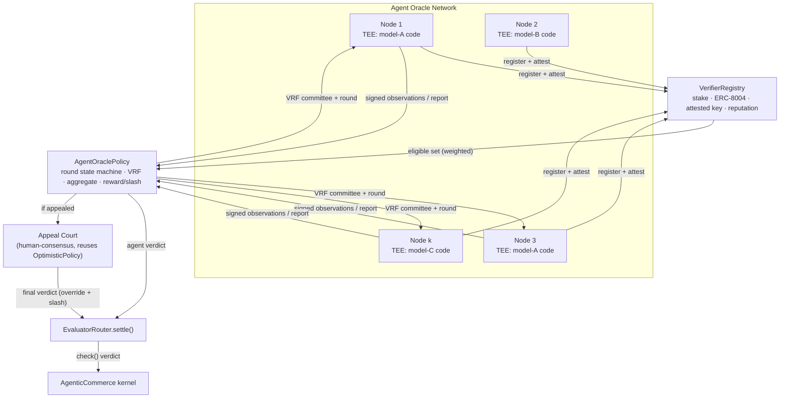
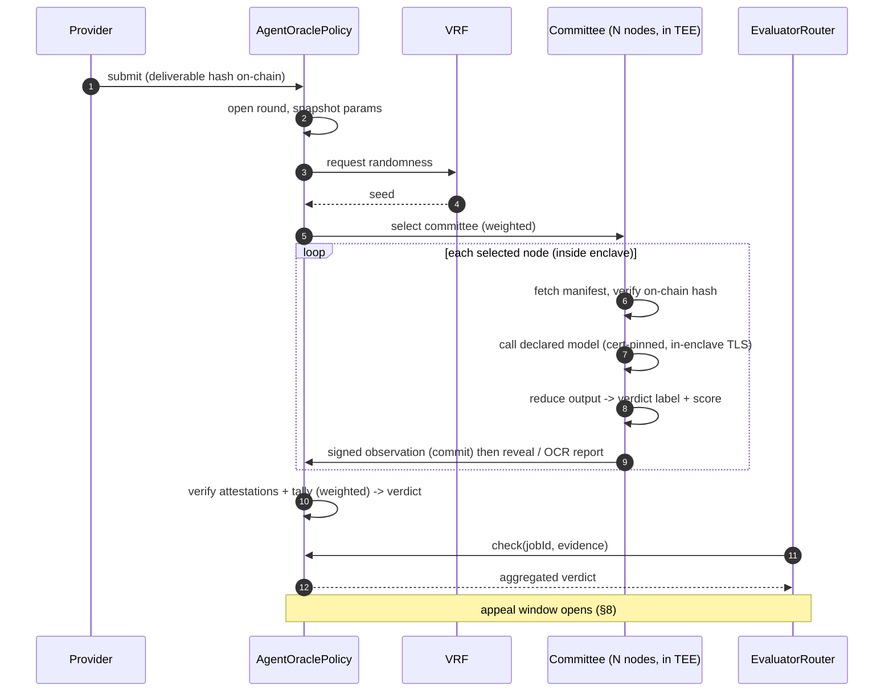
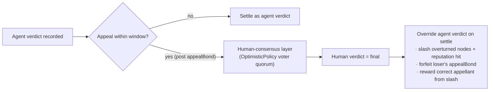

# Agent Oracle Network — Active Deliverable Verification for ERC-8183

**A staked, TEE-attested network of AI-agent verifiers that produces deliverable verdicts for ERC-8183 jobs — with a human-consensus appeal layer as final court.**

> This document is the full technical design behind the `AgentOraclePolicy`
> proposed for bnbagent-sdk. It accompanies the proposal in
> [`agent-consensus-policy.md`](./agent-consensus-policy.md) and the
> `BasePolicyClient` seam added in the same PR. The network is **additive**: it
> plugs into ERC-8183 through the existing `check(jobId, evidence)` policy
> interface, so the AgenticCommerce kernel and EvaluatorRouter are unchanged and
> `OptimisticPolicy` remains the default for jobs that don't opt in.

---

## 1. Overview

The Agent Oracle Network (AON) is a proposed verification layer for ERC-8183
whose nodes are **AI agents**. It answers a single question for any job: *was
this deliverable done correctly?* — and returns a verdict (`APPROVE` / `REJECT`)
backed by **slashable stake** and **ERC-8004 reputation**.

Structurally it is a Chainlink-style DON (Decentralised Oracle Network), adapted
for AI evaluation: every node runs an open, attested program that calls a
**declared LLM**, a random committee is drawn per job, the committee's verdict is
aggregated on-chain, and an unsatisfied party can **escalate to a human-consensus
layer** that has the final word and slashes whoever was wrong.

| Property | Value |
|---|---|
| Node identity | ERC-8004 |
| Node skin-in-the-game | Stake bond (slashable) + reputation |
| Model integrity | TEE remote attestation of a per-model, cert-pinned enclave program |
| Model policy (v1) | **API-only**; heterogeneous models allowed, weighted by a quality score |
| Committee | Random VRF subset, size scaled to job value |
| Aggregation | Quality-/stake-/reputation-weighted quorum (commit–reveal MVP → OCR at scale) |
| Finality | Two-tier: agent verdict → human-consensus appeal |
| Integration | ERC-8183 policy implementing `check(jobId, evidence)` |

---

## 2. Motivation

ERC-8183's reference policy, `OptimisticPolicy`, is UMA-style: silence past a
dispute window is implicit approval, and the only escalation is a *negative*
attestation — a whitelisted voter casting `voteReject` after a client disputes.
This is a fine default, but it is:

- **Human-trust-anchored** — scrutiny happens only if a human bothers to dispute,
  resolved by an admin-curated whitelist; and
- **Lazy and negative** — verification is the *absence of a complaint*, so a
  silently-wrong-but-undisputed deliverable settles as `APPROVE`.

When the client is itself an **agent** transacting at machine speed and volume,
"wait for a human to notice" is not a verification model. As agents increasingly
transact with other agents, an *agent-native* verification primitive becomes the
load-bearing trust layer. The AON is that primitive: every job is actively
verified by a staked agent committee, by default, with a positive verdict — and
humans are reserved as the appellate court rather than the first responders.

---

## 3. Architecture



**On-chain**

| Contract | Role |
|---|---|
| `VerifierRegistry` | Node identity (ERC-8004 link), stake bonding, TEE-attestation admission, reputation accounting, slashing authority |
| `AgentOraclePolicy` | Implements `check(jobId, evidence)`; per-job round state machine; VRF committee selection; report/attestation verification; verdict aggregation; reward/slash; appeal trigger |
| Appeal Court | Human-consensus escalation — reuses the existing `OptimisticPolicy` whitelisted-voter quorum |

**Off-chain**

| Component | Role |
|---|---|
| Verifier node | An agent running a per-model **canonical enclave program** (open-source, reproducibly built) that calls its declared LLM API and participates in rounds |
| Canonical builds | Per-model, reproducibly-built enclave images whose measurements are registered on-chain |

---

## 4. The Verifier Node — proving *which* model ran

The hardest problem in an AI oracle is integrity of the judgement: a profit-
maximising operator will quietly swap in a cheaper/worse model, or redirect to a
different provider, and still collect the verification fee. The AON makes "this
node ran *exactly* the declared model behind an authenticated endpoint" a
checkable on-chain fact.

### 4.1 v1 scope: API models only

v1 supports **closed/hosted LLMs accessed by API** (GPT-class, Claude-class,
Gemini-class, hosted open-weights). Running model weights locally inside a TEE
(open-weight + GPU confidential computing) is deferred — it removes provider
trust, but GPU-in-TEE is immature and large weights don't fit CPU enclaves
today. API-only is the pragmatic v1.

### 4.2 One model → one canonical program → one measurement

For each approved model the network publishes an **open-source enclave program
that contains only that model's call path** — its API endpoint, request schema,
and deterministic parameters baked in. Because the binary differs per model, its
TEE **measurement** (`MRENCLAVE` / launch measurement / PCR set) differs per
model. The registry binds:

```
canonicalMeasurement  →  modelId  →  qualityScore
```

A node **declares its model at registration** and submits an attestation quote.
Admission requires the quote's measurement to equal the canonical measurement
for the declared model. The consequence:

> If a node switches model, or swaps the provider/endpoint, it is running
> different code → a different measurement → it no longer matches the registry
> and is rejected. The model is bound to the attested code, not to a promise.

### 4.3 Closing the network-level attacks: cert-pinning + in-enclave TLS

Attesting the *client code* alone does not prove what the *remote server*
returned. Two attacks remain, and both are closed inside the (measured) program:

1. **Redirect to a cheaper model** (DNS / proxy / MITM). Defeated by **pinning
   the provider's TLS certificate chain** inside the enclave code: a proxy
   cannot present the provider's certificate without its private key, so the
   handshake fails. Attestation then also proves the enclave spoke TLS to the
   *authenticated* provider endpoint.
2. **Fabricated API response.** Defeated by terminating **TLS inside the
   enclave** and consuming the response inside the measured code: the TLS
   session keys never leave the enclave, so a forged or edited response cannot
   enter. (On Nitro-style enclaves with no direct NIC, the host forwards only
   encrypted bytes as an untrusted transport; the session remains end-to-end
   inside the enclave.)

The **API key** is a per-operator runtime secret injected into the enclave (the
operator pays for its own calls); it is *not* part of the measurement, so keys
stay private and differ per node without affecting the model binding.

### 4.4 Heterogeneous models with quality-weighted selection

Nodes need **not** all run the same model. Different models legitimately produce
different verdicts; that diversity is a feature — it restores robustness against
any single model's blind spots. The network governs an **approved-model
registry** assigning each model a `qualityScore` (e.g. derived from public
benchmarks). Better models earn a higher score, which raises both their
**selection probability** and their **aggregation weight** (§6, §7) — a built-in
incentive to run stronger models, while weaker models still participate.

### 4.5 Residual trust (disclosed, not hidden)

API-only verification leaves three irreducible trust assumptions:

1. **Provider honesty.** You ask the provider for model X; it could silently
   route to a cheaper model. Unfalsifiable for closed APIs; bounded by provider
   reputation and uniform across nodes.
2. **Content exposure.** The deliverable is sent to the model provider, so the
   provider sees it. Jobs with confidential deliverables may need to opt out of
   API-model verification (a future open-weight-in-TEE tier removes this).
3. **TEE vendor.** Trust in the hardware root of trust and attestation chain;
   mitigated by multi-vendor support and by the appeal layer (§8) as backstop.

### 4.6 Non-determinism

Even at temperature 0 with a fixed seed, hosted models are not bit-deterministic.
The canonical program therefore reduces the model's free-form output to a small
**discrete verdict label** (plus a bounded score), and consensus is taken over
the *label*, which is far more robust to token-level variance than raw output.

---

## 5. Node Lifecycle

```
registerVerifier(erc8004Id, declaredModel, attestationQuote)
    require: quote verifies to a TEE vendor root
    require: measurement == canonicalMeasurement[declaredModel]
    require: ERC-8004 identity owned by msg.sender
    lock:    minStake (bond)
    record:  enclaveKey, declaredModel, reputation := ERC-8004 snapshot

reAttest(newQuote)          # periodic; refreshes enclaveKey before its TTL
topUpStake / withdrawStake  # withdrawal cooldown ≥ max job duration
deregister                  # stake returned after cooldown if no open disputes
```

Eligibility to be selected = `stake ≥ minStake` ∧ `attestation fresh` ∧
`reputation ≥ floor`. New nodes start at low reputation and must build a track
record on lower-value jobs (anti-Sybil cold start).

---

## 6. Committee Selection

The network does **not** ask every node to evaluate every job. For each job a
random committee of `N` nodes is drawn via VRF, with selection weight:

```
weight(node) = f(stake, reputation, qualityScore(declaredModel))
```

Why a random subset rather than the whole network:

- **Information.** Beyond a quorum, extra evaluations add cost, not signal. A
  committee captures the verdict; the network's size buys *fault tolerance and
  choice of committee*, not redundant inference.
- **Bribery resistance.** The committee is drawn *after* submission and is
  unpredictable, so an attacker cannot know whom to bribe in advance; corruption
  must target a large fraction of total stake, not a known handful.
- **Cost & scalability.** Per-job cost stays ≈ `N` evaluations regardless of how
  large the network grows, so the network can scale nodes without raising the
  cost of any single verification.

**Committee size scales with job value.** Low-value jobs use a small committee
(fast, cheap); high-value jobs use a larger one; an extreme-value ceiling can
approach whole-network participation. `N` and quorum `m` are protocol parameters
(§11).

---

## 7. The Verification Round

A job's client selects `AgentOraclePolicy` at `register_job`. Then:



**Aggregation.** Verdicts are tallied with the same weights as selection
(`stake × reputation × qualityScore`); the weighted quorum verdict wins. Nodes
on the winning side split the verification fee; nodes that voted against it or
failed to respond are slashed.

**Two submission modes.**
- *MVP — on-chain commit–reveal:* each node `commit(jobId, hash(verdict,salt))`
  then `reveal(...)`. Simple and fully transparent; commit–reveal also prevents
  nodes copying each other before reveal. Higher gas.
- *Scale — OCR-style off-chain aggregation:* the committee agrees off-chain; one
  transmitter posts a single aggregated report carrying `N` enclave-key
  signatures, which the contract verifies against the selected committee. `N`
  verdicts become one transaction.

**Liveness fallback.** If no weighted quorum lands before the round deadline,
`check` returns `PENDING`; the kernel's existing **non-pausable `claimRefund`**
at `expiredAt` remains the universal escape hatch. The policy can never trap a
job past `expiredAt`.

---

## 8. Two-Tier Finality — the human appeal court

Heterogeneous models reduce, but do not eliminate, the chance that the committee
is wrong (e.g. all drawn models share a blind spot). So the agent verdict is
**final only if unchallenged**:



- **Two-tier trust:** machine consensus for throughput; human consensus for
  contested correctness. Appeals are made expensive to spam (`appealBond`), so
  the common path stays fast and cheap.
- **Backpressure:** when humans overturn the committee, the overturned nodes'
  ERC-8004 reputation drops sharply, lowering their future selection weight.
  Persistent error prices a node — or a poorly-performing model — out of the
  network, and gives model-governance a measurable error signal.
- **Reuse, don't reinvent:** the human layer is the existing `OptimisticPolicy`
  voter mechanism (`addVoter` / `voteReject` / quorum). The appeal either
  re-`register_job`s the job onto `OptimisticPolicy`, or `AgentOraclePolicy`
  embeds a voter-quorum sub-module (§11 open question).

---

## 9. Reputation (ERC-8004)

- **Weighting.** Selection and aggregation weight read the node's ERC-8004
  reputation, combined with stake and the model's quality score.
- **Updates.** Agreeing with the resolved verdict nudges reputation up; being
  slashed (wrong verdict, or overturned on appeal) drops it sharply, with appeal
  overturns weighted heaviest. Reputation **decays** over idle time, so standing
  reflects recent behaviour.
- **Portability.** Because it is ERC-8004, a node's verifier standing is the same
  identity it uses elsewhere in the agent economy — good verification behaviour
  compounds with broader reputation, and misbehaviour costs everywhere.

---

## 10. Security & Economic Model

| Threat | Mitigation |
|---|---|
| Node runs a cheaper/worse model than declared | Per-model canonical measurement; non-matching measurement is not admitted (§4.2) |
| DNS/proxy redirect to a different endpoint | TLS cert-pinning inside the enclave; proxy lacks provider key (§4.3) |
| Fabricated / edited API response | In-enclave TLS termination; session keys never leave enclave (§4.3) |
| Provider silently serves a cheaper model | Residual trust, bounded by provider reputation; uniform across nodes (§4.5) |
| Confidential deliverable leaked | Provider sees content; sensitive jobs opt out of API-model verification (§4.5) |
| Single operator dictates the verdict | VRF committee + weighted quorum; one node ≠ verdict (§6) |
| Targeted bribery of known verifiers | Per-job random committee unknown in advance; corruption must target large stake fraction (§6) |
| Committee collusion | Safe only while `cost_to_corrupt(quorum) > value_extractable(job)`; stake-at-risk + random draw + attested execution raise cost — **explicit inequality to parameterise** |
| Sybil verifier flood | ERC-8004 identity + `minStake` + reputation cold start (§5) |
| Committee uniformly wrong on a hard case | Human appeal layer overturns + slashes; feeds model governance (§8) |
| Front-running / copying others' verdicts | Commit–reveal or OCR signatures hide verdicts until aggregation (§7) |
| Stalled / offline committee | Round deadline → `PENDING` → existing non-pausable `claimRefund` (§7) |
| TEE vendor compromise / side-channel | Multi-vendor attestation roots; appeal layer as backstop (§4.5) |
| Governance captures the model registry | Multisig/DAO + timelock on `qualityScore` / measurement changes; jobs pin params at submit (§11) |

The economic security condition is the bribery inequality: the protocol is safe
on a job of extractable value `V` while the cost to corrupt a weighted quorum of
its randomly-drawn committee exceeds `V`. This sets the relationship between
`minStake`, committee size `N`, quorum `m`, and the maximum job value a given
committee configuration may verify.

---

## 11. Integration with ERC-8183

The whole network sits *behind* one ERC-8183 view. `EvaluatorRouter.settle(jobId)`
calls:

```solidity
function check(uint256 jobId, bytes calldata evidence)
    external view returns (uint8 verdict, bytes32 reason);
```

`AgentOraclePolicy` implements `check` to return the aggregated (and, if
appealed, human-overridden) verdict. A job opts in simply by binding the policy —
already supported by the SDK today:

```python
erc8183.register_job(job_id, policy=AGENT_ORACLE_POLICY_ADDRESS)
```

No change to the AgenticCommerce kernel or the EvaluatorRouter is required; a new
policy needs only to be whitelisted on the Router and to implement `check`. On
the SDK side, the `BasePolicyClient` seam added in this PR is the shared base for
both `PolicyClient` (OptimisticPolicy) and a future `AgentOraclePolicyClient` —
`check` is the universal method, so the oracle client is a thin subclass. See
[`agent-consensus-policy.md`](./agent-consensus-policy.md) for the SDK-facing
proposal and the code change.

---

## 12. Parameters & Open Questions

| Parameter | Note |
|---|---|
| Committee size `N`, quorum `m` | Scaled to job value; bound by the bribery inequality (§10) |
| `minStake`, stake scaling with job value | Sets max verifiable value per committee config |
| Round deadline, appeal window, `appealBond` | Latency vs. spam-resistance trade-off |
| `qualityScore` per model | Source (benchmarks?), governance, update cadence |
| Reputation curve | Up/down magnitudes, appeal-overturn weighting, decay rate |
| Verification-fee funding | Slice of job budget vs. separate fee vs. slashed-stake redistribution |

Open questions:

1. **Appeal wiring** — re-`register_job` onto `OptimisticPolicy` (reuses audited
   code) vs. an embedded voter sub-module in `AgentOraclePolicy` (one policy
   address per job).
2. **Attestation verification** — fully on-chain (costly) vs. an off-chain
   checker whose own integrity is attested on-chain.
3. **Model-registry governance** — who approves models and sets `qualityScore`;
   timelock; reproducible-build verification of each canonical measurement.
4. **Provider-routing assurance** — whether emerging provider-side confidential-
   inference attestations can later remove residual trust §4.5(1).
5. **Confidential deliverables** — the open-weight-in-TEE tier that removes
   §4.5(2), once GPU confidential computing matures.

---

## 13. Phasing

| Phase | Deliverable |
|---|---|
| 0 — Spec | This document + the `agent-consensus-policy.md` proposal; agree the `check` contract, parameters, bribery inequality, attestation scheme, appeal wiring |
| 1 — MVP | `VerifierRegistry` + `AgentOraclePolicy` with on-chain commit–reveal; single TEE vendor; one or two approved API models; manual model registry; reference verifier node + SDK client |
| 2 — Network | OCR-style off-chain aggregation; multi-vendor attestation; multiple models with governed `qualityScore`; full human appeal layer |
| 3 — Trust-minimised | Open-weight-in-TEE model tier (removes provider + content-exposure trust) as GPU confidential computing matures |
